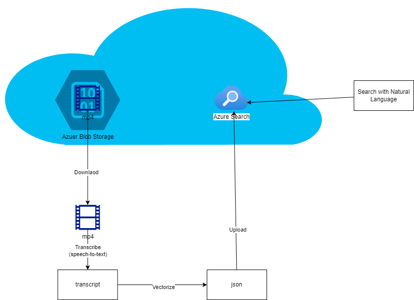

# Searching Videos

The code is in the _src_ folder.

Sample videos are in the _data\videos-to-search_ folder. They are all in MP4 format.

You will need to:

- In Azure:
    - Create an Azure Storage account with 2 containers: "mp4s" and "transcripts"
    - Upload the mp4 files into the "mp4s" blob container
    - Create an Azure OpenAI service. In Azure AI Foundry, deploy the "whisper" model.
    - Run transcribe-videos.py. This only needs to be done once. It transcribes all videos and uploads the transcription text files into the "transcripts" container
    - Create an Azure AI Search Service and an index connected to the Azure Storage Account
- In the code:
- To transcribe videos, index transcripts, and update Azure AI Search:
    - Rename config-sample.py to config.py
    - update values in config.py corresponding to the assets created in Azure
    - Run app.py
- To search video transcripts with natural language
    - Run search.py

Here is the flow of information:

